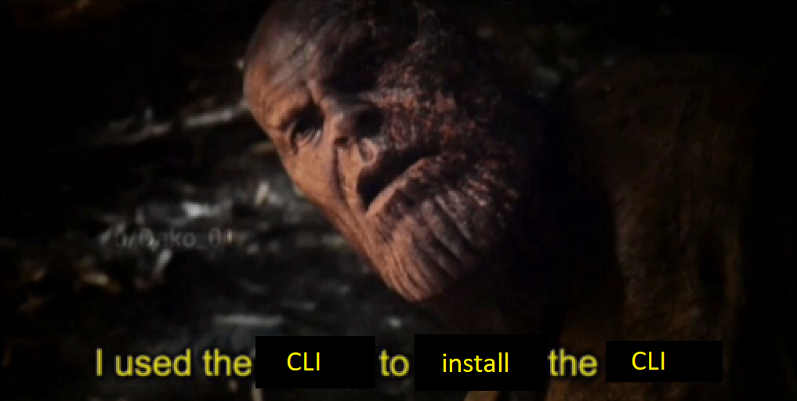

# Symfony: Requiem
This lil' project is a learning challenge.
And the challenge's name is: Symfony.
So I will not focus on finishing everything in time, my main priority will be learning.

The only Symfony I have ever known is in music, and even then my knowledge of it is very limited.
These are the goals that have been set by our coaches for this assignment:

* Install Symfony
* Learn about the lifecycle of software
* Learn to use the MVC layer of Symfony
* Learn to use the routing component
* Learn the basics of twig

---

## Installing Symfony
The installing process should've been an easy one. **It should've**. 
But I did end up with some minor problems.
For reasons still unknown to me, my GitBash terminal couldn't access my PHP.
Commands like <code>php -v</code> and the like did work in the terminal, but once I tried the <code>symfony new my_project_directory --version="6.1.*" --webapp</code>, it gave me an error saying that the no PHP binaries were detected.

The issue was fixed the moment I started using the Command Prompt tho, so that's nice.

I thought it was funny that I had to use the Windows Powershell to install Scoop so I could install Symfony.
So I made a meme about it, because of course I did.

## Getting Started: The Lucky Number
No I'm not talking the numbers 69, 420 or 42069.
I'm talking about a small mini-task I will be doing before starting on the big-boy assignment.
In the Symfony documentation, they have a lil' guid there on how to create a page.
I will be following along those steps in order to understand how Symfony works a bit better.
Once that's done, I will **DEMOLISH** the task given to us by the coaches with my newfound Symfony Powers!!

### Creating a page: Route and Controller
I started out by creating a "Controller" class with a "controller" method inside of it.
This was placed in the <code>src/controller</code> folder.
Once the controller has been made, I had to assign a 'route' to it.
So I created a route in the <code>routes/</code> folder.

This was easy enough, because I have been made a bit familiar with routes thanks to an assignment we made before this one in React.

---

## Symfony Terminology
If there's one thing Web Development is known for, it's having a lot of big fancy schmancy words I keep forgetting the definition of.
So the goal of this part of the README is to write down some terminology in my own words, so I can remember them.

* Route:
  * The part of the URL that comes after the <code>/</code> that points to your page.
  * For example, in the case of <code> www.fakewebsitedonotclick.pls/about-us </code>, the <code>/about-us</code> is the route.
    * So this URL is the URL that goes to your page.
* Controller:
  * A controller is the PHP function you write that builds the page.
  You take the incoming request information and use it to create a Symfony Response object, which can hold HTML content, a JSON string or even a binary file like an image or PDF.